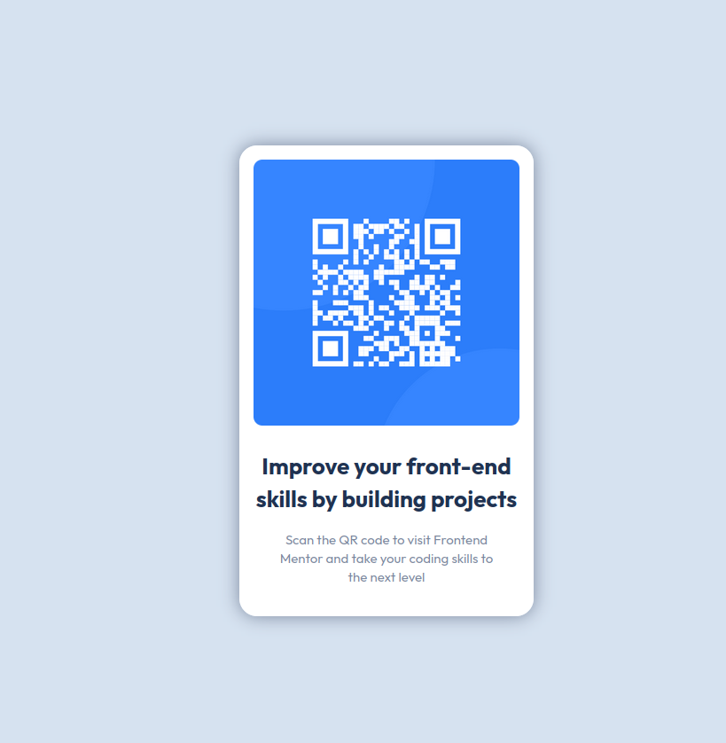

[ENGLISH]

Frontend Mentor - QR Code Component

This solution responds to the QR code component challenge on Frontend Mentor. This project helped me improve my skills in HTML and CSS by recreating a professional and responsive design.

Screenshot

Links

    Frontend Mentor Solution: ()
    Livesite ()

Process
Built With

    Semantic HTML5

    CSS with custom properties

    Flexbox

    Media queries for mobile responsiveness

What I Learned

    Mastering layout with Flexbox

    Using media queries to adapt design on mobile

    Applying a Google Fonts font in a project

    Following a pixel perfect design

    Structuring semantic and accessible HTML

Future Improvements

    Continue practicing font management, CSS parent-child hierarchy, and sizing for perfect rendering

    Improve accessibility (contrast, keyboard navigation)

    Optimize CSS for better maintainability

    Deepen Media Queries knowledge

Useful Resources

    CSS Flexbox Documentation - MDN

    Media Queries Guide - MDN

    Google Fonts Documentation

Author

    Kevin2911FR

    Frontend Mentor

Acknowledgments

Thanks to Frontend Mentor and the Discord community for their support and valuable feedback.
Congratulations to everyone taking on this challenge!

[FRANCE]

Frontend Mentor - QR Code Component

Cette solution répond au défi QR code component sur Frontend Mentor. Ce projet m’a permis d’améliorer mes compétences en HTML et CSS en reproduisant un design professionnel et responsive.

Capture d'écran

Liens

    Solution Frontend Mentor : ()
    Livesite ()

Processus
Construit avec

    HTML5 sémantique

    CSS avec variables custom

    Flexbox

    Media queries pour responsive mobile

Ce que j’ai appris : 

    Maîtriser la mise en page avec Flexbox

    Utiliser les media queries pour adapter le design sur mobile

    Appliquer une police Google Fonts dans un projet

    Respecter un design « pixel perfect »

    Structure du HTML la plus logique et accessible possible

Axe d’amélioration

    Continuer à m’exercer sur la gestion des polices, la hiérarchie CSS parents/enfants et les tailles pour un rendu parfait

    Approfondir l’accessibilité (contrastes, navigation clavier)

    Optimiser le code CSS pour une meilleure maintenabilité

    Approfondir Media Queries

Ressources utiles

    Documentation CSS Flexbox - MDN

    Guide des media queries - MDN

    Documentation Google Fonts

Auteur

    Kevin2911FR

    Frontend Mentor

Remerciements

Merci à Frontend Mentor et à la communauté Discord pour leur entraide et leurs retours pertinents.
Bravo à tous ceux qui relèvent ce challenge !